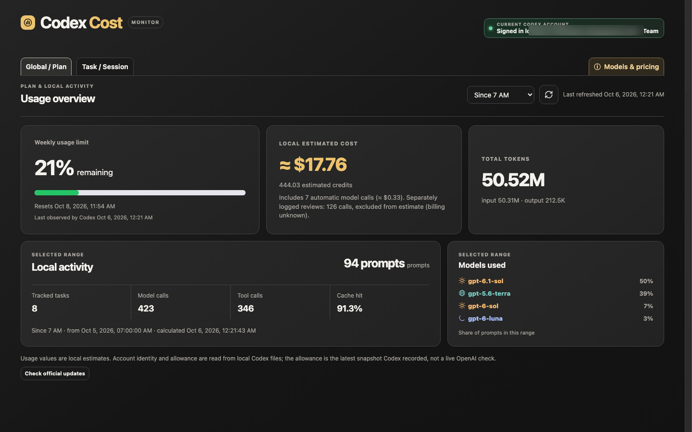
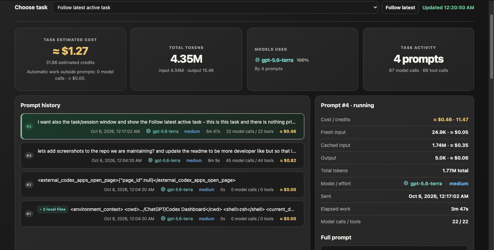
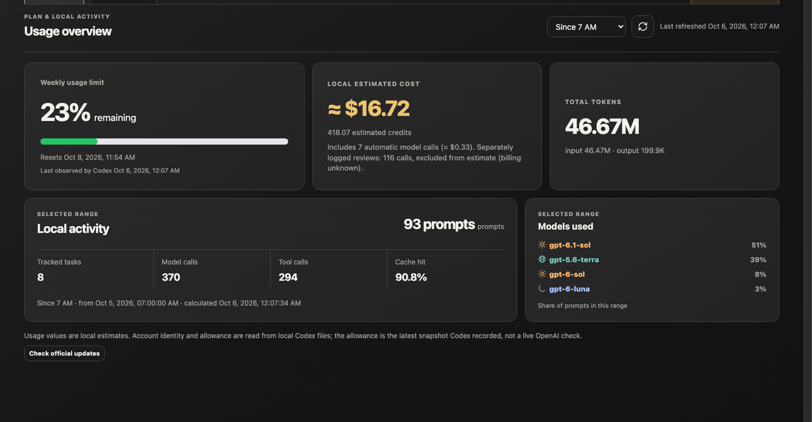

# Codex Cost Dashboard

A local web dashboard for inspecting the Codex session history already on your computer: task activity, token usage, model mix, locally observed allowance, and estimated credit cost.



It binds to `127.0.0.1` only. Session files stay on the machine running it; the default experience has no telemetry, analytics, CDN assets, API calls, or external requests.





> [!IMPORTANT]
> This is an independent community tool, not an official OpenAI product. Codex's JSONL session format is an implementation detail that may change. Estimates are not invoices, and the observed plan meter is not a token-to-plan conversion.

## At a glance

- Global views for the last 24 hours, since 7 AM, seven days, or all local history
- Per-task totals and prompt history: model, effort, duration, tools, token counts, and estimated cost
- A bundled Models & pricing guide, including credit rates, model roles, and reasoning-effort context
- Locally decoded account/plan claims and the latest allowance snapshot saved by Codex
- Inline markers for skills, images, local files, and links in prompt history

## Quick start

## Requirements

- Codex with locally persisted session history
- macOS, Linux, or Windows
- Python 3.10 or newer (`python3 --version`)

Codex stores local state under `CODEX_HOME`, which defaults to `~/.codex`, according to the [official OpenAI Codex configuration documentation](https://learn.chatgpt.com/docs/config-file/config-advanced#config-and-state-locations). The dashboard follows that setting automatically.

## Install and run

### macOS or Linux

```bash
git clone https://github.com/EitanBakirov/codex-cost-dashboard.git
cd codex-cost-dashboard
# Use the Python 3.10+ executable on this computer (for example python3.12).
python3.12 -m venv .venv
source .venv/bin/activate
python -m pip install .
codex-cost-dashboard --open
```

If `python3 --version` reports an older version (macOS can still ship Python
3.9), use the newer executable installed on your machine, such as `python3.12`
or `python3.11`.

If your shell still picks an older globally installed dashboard command after
activating the environment, use the installed module directly:

```bash
python -m codex_cost_dashboard.dashboard --open
```

### Windows PowerShell

```powershell
git clone https://github.com/EitanBakirov/codex-cost-dashboard.git
Set-Location codex-cost-dashboard
py -3 -m venv .venv
.\.venv\Scripts\python.exe -m pip install .
.\.venv\Scripts\codex-cost-dashboard.exe --open
```

The page opens at [http://127.0.0.1:8766](http://127.0.0.1:8766). Keep the terminal open while using it and press `Ctrl-C` to stop.

You can also run it directly from the clone without installing anything:

```bash
python3.12 run_dashboard.py --open
```

PowerShell equivalent:

```powershell
py -3 run_dashboard.py --open
```

### Verify the clone

```bash
python -m unittest discover -s tests -v
```

The project has no runtime dependencies outside the Python standard library.

## Install with a coding agent

Give your local coding agent this prompt:

> Clone `https://github.com/EitanBakirov/codex-cost-dashboard.git`, install it in a project-local Python 3.10+ virtual environment using the instructions for this operating system, run its test suite, and launch `python -m codex_cost_dashboard.dashboard --open`. Keep it local-only, do not copy or upload my Codex session files, and do not change my Codex configuration.

## Architecture and local data boundary

The dashboard is deliberately small and portable:

```text
Codex local state                 Dashboard process                 Browser
─────────────────                 ─────────────────                 ───────
$CODEX_HOME/sessions/*.jsonl ──▶  monitor.py parses events       ─▶  127.0.0.1:8766
$CODEX_HOME/session_index.jsonl   dashboard.py aggregates/views       static HTML/CSS/JS
$CODEX_HOME/auth.json             rate_card.py estimates credits
```

| Component | Responsibility |
| --- | --- |
| `monitor.py` | Reads append-only JSONL session events and derives prompts, calls, tools, token counters, and allowance snapshots. |
| `dashboard.py` | Serves the local UI and JSON endpoints; aggregates sessions and handles local preferences. |
| `rate_card.py` | Holds the versioned credit-rate table used by the estimator. |
| `dashboard.html` | Self-contained browser UI; the server injects the bundled model guide and icon assets. |
| `openai_updates.py` | Performs the explicit, opt-in public-documentation update check. |

`CODEX_HOME` defaults to `~/.codex` and is honored when set. The expected locations are documented in the [official Codex configuration guide](https://learn.chatgpt.com/docs/config-file/config-advanced#config-and-state-locations).

### Read/write/network contract

| Boundary | Default behavior |
| --- | --- |
| Reads | Session logs, optional session index, and optional auth claims under `CODEX_HOME`. |
| Writes | Only dashboard state under `$CODEX_HOME/cost-dashboard/`; never session logs or Codex configuration. |
| Network | None. The optional documentation check contacts only the two official public URLs named below. |
| Listening address | `127.0.0.1` only; it is not exposed on the LAN. |

This model makes it suitable for people and local coding agents: clone it, run it in a project-local virtual environment, and point it at an alternate session directory with `--sessions-dir` when needed. Do not commit session logs, `auth.json`, or dashboard state.

## Options

```text
codex-cost-dashboard [--sessions-dir PATH] [--state-file PATH]
                     [--usd-per-credit NUMBER] [--port PORT] [--open]
                     [--check-openai-updates]
                     [--check-openai-updates-daily]
```

- `--sessions-dir`: override the default `$CODEX_HOME/sessions`
- `--state-file`: change where the selected-task preference is saved
- `--usd-per-credit`: customize the dollar-equivalent estimate. Credit purchase prices and discounts vary by plan, so this is not an invoice.
- `--port`: use another localhost port if `8766` is occupied
- `--open`: open the page in the default browser
- `--check-openai-updates`: explicitly fetch the two public official OpenAI documentation pages, report whether they changed, then exit
- `--check-openai-updates-daily`: opt in to at most one public documentation check per day when the dashboard starts. The Global / Plan page also has a **Check official updates** button for an explicit one-time check.

## Pricing and model maintenance

The bundled rate card is versioned with each dashboard release. It currently
uses the official ChatGPT **Standard-speed credit** rates, not API-key USD
prices. This distinction matters: ChatGPT credits are what Codex with ChatGPT
sign-in consumes, while API-key sessions use separate API pricing.

The **Models & pricing** guide is available from the far-right navigation tab.
Its table reads the same bundled rates as the calculator. It summarizes when
each general model fits, how fresh/cached/output token rates differ, and why
higher reasoning effort can change a task's duration and total usage without
changing its per-token rate. An anonymized, fixed snapshot of all locally
available metered prompts—3,091 GPT-5.6 Sol and 276 GPT-6 Sol—compares one
submitted prompt through its completed response. The sample is illustrative, not a live
analysis of each installer's logs or a model-quality benchmark. The guide is
bundled locally, so it does not make network requests when opened.
It compares identical model-call bands for both Sol versions to show how
repeated calls accumulate cached context, then offers guidance for scoping
bounded work. The guide's elapsed-time comparison uses only September prompts
with credible start and completion timestamps: 49 GPT-5.6 Sol and 276 GPT-6
Sol. Response spans include tool waits and are not billable model-compute time.
Older GPT-5.6 timestamps are compressed and excluded from that timing
comparison. These fixed sample figures are separate from each installer's live totals.

Celestial model families use small SVG icons before their names throughout the
dashboard: stars for Astra, sun for Sol, globe for Terra, and crescent for Luna.
Their colors are controlled by the four `--model-*` variables in
`src/codex_cost_dashboard/model_icons.css`; the SVG shapes remain unchanged when
the palette is adjusted. Numeric or unknown models keep their plain names.

The dashboard never automatically downloads or activates a new rate card. An
optional update check compares only these public documents:

- [Codex pricing and credit rates](https://learn.chatgpt.com/docs/pricing)
- [Codex models and retirements](https://learn.chatgpt.com/docs/models)

When either document changes, the dashboard shows a notice. Estimates remain
pinned to the installed rate card until a reviewed dashboard release updates
it. This prevents a silently changed webpage from rewriting local estimates.

For a manual terminal check:

```bash
python -m codex_cost_dashboard.dashboard --check-openai-updates
```

The companion `codex-cost-monitor` command provides a live terminal view. Use `codex-cost-monitor --help` for its options.

## Privacy model

The dashboard may read `$CODEX_HOME/sessions/**/*.jsonl`, `$CODEX_HOME/session_index.jsonl`, and `$CODEX_HOME/auth.json`. The auth file is used only to display non-secret account identity and plan claims locally.

It writes `$CODEX_HOME/cost-dashboard/dashboard-state.json` and, only after an explicit check or daily opt-in, `$CODEX_HOME/cost-dashboard/openai-update-state.json`. It does not modify Codex sessions or authentication. See [SECURITY.md](SECURITY.md) for the detailed boundary.

## Accuracy and limitations

- Estimates use token counters written to local Codex session logs and the rate table bundled with this release. The current rate-card version and source are exposed in the local API.
- Newer response records are counted once by response ID; older logs fall back to legacy token snapshots. Repeated snapshots do not add another model call.
- Automatic work without a user prompt is included in task and Global totals and shown separately. Guardian/automated-review logs are reported separately by token and call count, but excluded from the dollar estimate because their billing treatment is unknown.
- Included allowance, Fast mode, discounts, taxes, invoice adjustments, and server-side accounting are not available locally.
- The plan percentage is the latest rate-limit snapshot observed in local logs for the active account. Historical session logs may belong to a different account.
- Old sessions generally cannot be assigned reliably to an account because their logs may not contain account identity.
- Side chats and internal/automated work are included only when Codex persists enough local information to identify them safely.
- A prompt can be shown as **model not recorded** when its saved local log has no reliable model association. Its tokens remain included, but an exact model-specific cost cannot be recovered from those local records alone and is excluded from the estimate.
- A named model without a bundled rate remains visible but contributes no estimated cost until a rate is added.
- Local logs can change across Codex releases. Please file a sanitized fixture when a new shape is not recognized.

## Develop and contribute

```bash
python -m pip install -e .
python -m unittest discover -s tests -v
```

Useful entry points:

- `python -m codex_cost_dashboard.dashboard --open` — run the local web dashboard
- `python -m codex_cost_dashboard.monitor --help` — inspect the terminal monitor options
- `python -m codex_cost_dashboard.dashboard --sessions-dir /path/to/sessions` — test against a non-default, sanitized fixture directory
- `python -m codex_cost_dashboard.dashboard --check-openai-updates` — perform the explicit public-documentation comparison

Before opening a pull request, run the test suite and keep fixtures sanitized. See [CONTRIBUTING.md](CONTRIBUTING.md) for repository conventions and [SECURITY.md](SECURITY.md) for the data boundary.

## License

[MIT](LICENSE)
